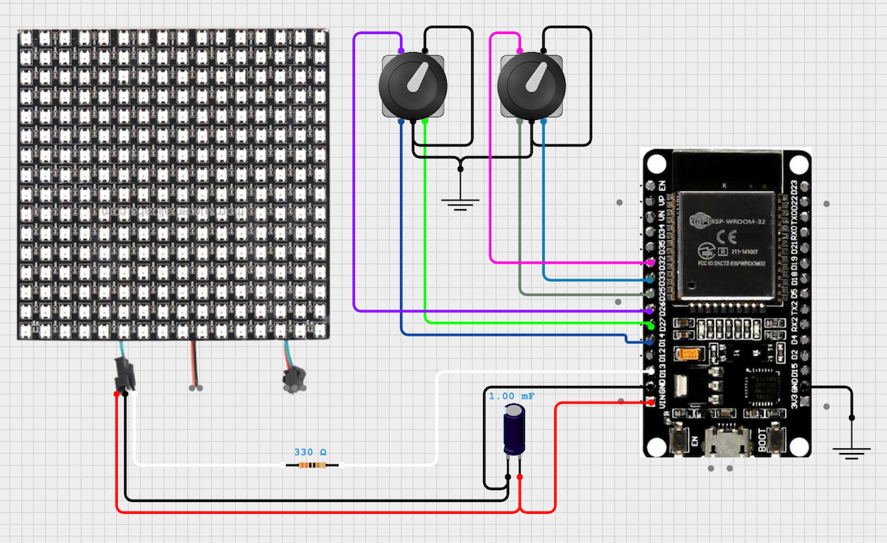
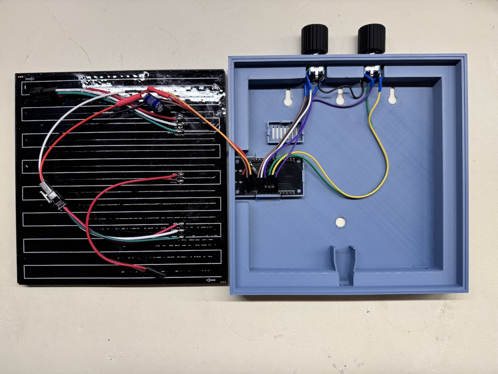

-----

# 💡 Animated LED Matrix

This project implements a custom controller for a **16x16 addressable LED matrix** using an **ESP32** to display high-framerate animations.
## Demo

https://v.redd.it/2gezibfc8v6g1/CMAF_1080.mp4

## Inspiration

This work was inspired by [Pipplee](https://pipplee.com/) - a project that displays animated GIFs on WLED installations.

## Rationale for a Separate Project

While Pipplee is excellent for managing an animation catalog, its reliance on WLED's preset system introduces two major limitations that this custom solution addresses:

### 1\. Upload/Load Speed

Pipplee loads animations by repeatedly uploading and editing WLED presets. According to the [WLED documentation](https://kno.wled.ge/features/presets/), frequent, random writes to the LittleFS preset file are **highly resource-intensive**.

> *...random writes to the preset file are very resource intensive. This means that while updating your presets, you might notice your light freezing and becoming unresponsive for up to a few seconds.*

Because Pipplee uploads a new preset every time an animation is switched, the system frequently becomes unresponsive, leading to a frustrating user experience.

### 2\. Framerate Limitation

Pipplee generates a separate WLED preset for every frame of an animation and uses a playlist to cycle through them.

The playlist feature in WLED imposes a **minimal preset duration of 0.2 seconds**, locking the maximum framerate at **5 FPS**. This project bypasses the WLED playlist limitation to achieve a significantly smoother animation display.

## Controls

The system is controlled using two rotary encoders, each with an integrated push button:

| Encoder | Rotation Action | Button Press Action | Pressed + Rotation Action |
| :--- | :--- | :--- | :--- |
| **Encoder 1 (Left)** | Switch the current animation | Toggle automatic animation switching on/off | N/A |
| **Encoder 2 (Right)** | Change the auto-switch frequency (1–60 seconds) | Pause the animation at the current frame | Adjust overall brightness |

## Circuit

### Connection Summary Table

The circuit utilizes two rotary encoders and an external power supply for the LED matrix.

| Component | Signal/Pin Name | ESP32 GPIO Pin | Constant Name | Connection Details |
| :--- | :--- | :--- | :--- | :--- |
| **LED Matrix** | Data Input ($D\text{IN}$) | **GPIO 13** | `DATAPIN` | Connected via a **330 $\Omega$ Resistor** to the LED matrix data line. |
| **LED Matrix** | Power ($V\text{CC}$) | **VIN** | N/A | Connects to the **external 5V** power supply rail. |
| **LED Matrix** | Ground ($G\text{ND}$) | **GND** | N/A | Connects to the main system ground. |
| **Bulk Capacitor** | ($+$) | **VIN** | N/A | A **1000 $\mu\text{F}$ 10V Capacitor** placed across VIN and GND for power smoothing. |
| **Encoder 1 (Left)** | A Channel ($A$) | **GPIO 14** | `ENC1_A` | Data Input (internal pull-up recommended). |
| | B Channel ($B$) | **GPIO 27** | `ENC1_B` | Data Input (internal pull-up recommended). |
| | Button ($S\text{W}$) | **GPIO 26** | `ENC1_BUTTON` | Data Input (internal pull-up recommended). |
| **Encoder 2 (Right)** | A Channel ($A$) | **GPIO 33** | `ENC2_A` | Data Input (internal pull-up recommended). |
| | B Channel ($B$) | **GPIO 25** | `ENC2_B` | Data Input (internal pull-up recommended). |
| | Button ($S\text{W}$) | **GPIO 32** | `ENC2_BUTTON` | Data Input (internal pull-up recommended). |

> 📌 **Note:** I used encoders which do not need power pins - only **GND** and **INPUT_PULLUP** type inputs.

### Circuit Image

The full interactive circuit diagram is available at: [cirkitdesigner url](https://app.cirkitdesigner.com/project/41ab95f8-726e-4743-9e6f-fff42ea1a658)

### Other circuit considerations
- You can use external power supply connected to LED matrix power inputs
- Make sure to use buck converter between matrix + terminal and ESP32 VIN if your LED matrix is 12V!
- When using WS2812b matrices, signal level converter such as SN74 is often recommended, but I don't have one and adding 330 Ohm resistor seems to work fine.

## 3D printed frame
I remixed [this](https://makerworld.com/en/models/122272-16x16-led-matrix-frame-with-diffuser-grid#profileId-131812) model to create [frame with encoders](https://makerworld.com/en/models/2109245-16x16-led-matrix-frame-with-encoders)
## Example build

## Animations Converter

The project includes a Python-based animation converter that transforms WLED presets (generated by Pipplee) into a C header file containing a **PROGMEM** array. This stores the animation data directly in the ESP32's flash memory for fast access.

Five animations are included in the repository. If you want more animations - respect the original developer who created hundreds of animations and purchase $3/year Pipplee license.

The conversion process is as follows:

1.  Load the desired animation into WLED.
2.  Save the preset (**Config -\> Security & Updates -\> Backup & Restore -\> Backup presets**).
3.  Rename the resulting JSON file and place it in the project's `animations` directory.
4.  Run the converter: `python3 convert.py`.
5.  Build and upload the project to the ESP32.

## Flash Requirements and Partitions

A 16x16 matrix frame requires $16 \times 16 \times 3 \text{ bytes} = 768 \text{ bytes}$ of storage (representing 3 color channels). While the NeoMatrix library uses the more compact RGB565 format (16 bits per pixel), the current storage format is essentially a 24bit bitmap of every frame.

The standard ESP32 4MB flash partition table reserves approximately 1.5MB for the application (app0) and 1.5MB for a second application (app1). This typically limits the storage to about **50 animations** (depending on frame count).

I wanted to store around 65 animations, so I added a **custom partition table** which uses 3MB app0 parition.

### BOM

| Component | Price, €$ | Link |
|---|---|---|
|ESP32 Devkit|4|[Aliexpress](https://www.aliexpress.com/item/1005008819591380.html)|
|16x16 LED Matrix|7|[Aliexpress](https://www.aliexpress.com/item/4000544584524.html?spm=a2g0o.order_list.order_list_main.5.3a121802zOs6bk)|
|2 Encoders |1.5|[Aliexpress](https://www.aliexpress.com/item/1005010063290644.html)|
|3D printed frame |3|[Makerworld](https://makerworld.com/en/models/2109245-16x16-led-matrix-frame-with-encoders#profileId-2281764)|
|1000 uF capacitor|0.1||
|330 Ohm resistor |0.05||
-----
